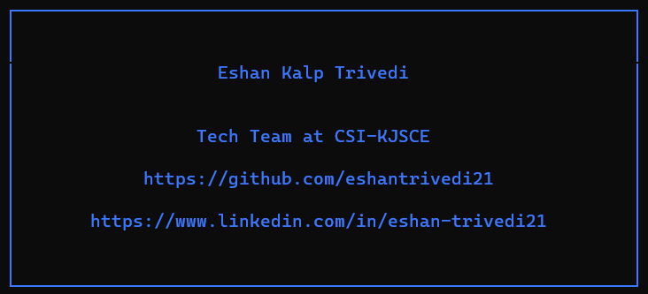

# NPX CARD: My very first node package!

<br>

## To try this, follow the given steps 

### `STEP 1:`  Download Nodejs:

### `STEP 2:`  Open Terminal / CMD / Bash:
```bash
npx eshan-trivedi
```

### `STEP 3:`  Here's the Output:


### `STEP 4:`  Enjoyed? Thankss!!!
